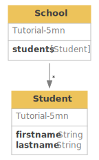
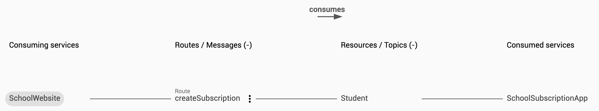
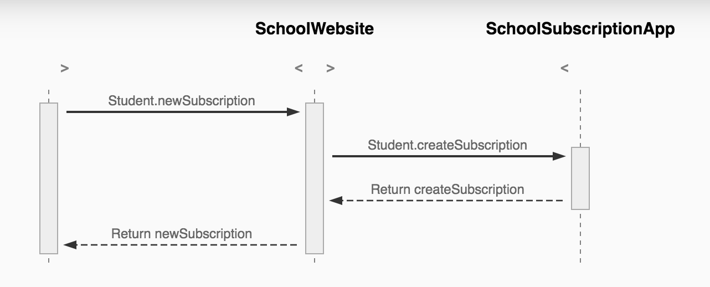

> Learn about Akwatype, how it works, and how to use it in this series of articles. For an in-depth learning experience with practical tutorials, Go to [How to Akwatype](todo) fullstack tutorial website.

Akwatype is a online tool that can give you all comprehension of your exchanges. Akwatype isn't tied of any specific exchange technologies (HTTP, Kafka, RabbitMQ,…) or any software languages (Java, Typescript,…). Akwatype can be used to describe functionnaly your applications.

Akwatype describes the two aspects of exchanges
- **Model** : What are the data exchanged ?
- **Service** : What are the flow, from and to what ?

An Akwatype description is created by defining types and fields on those types for **Model**, and services and exposure/consummation for **Services**. For example, an Akwatype description that tells us a School has Student might look something like this:

```graphql
type School {
  students: [Student]
}

type Student {
  firstname: String
  lastname: String
}
```



If there is two apps for the subscription process, that can be describe like this:

```akwatype
service SchoolWebsite {
  expose Student {
    route newSubscription {
      consume SchoolSubscriptionApp.Student.createSubscription
    }
  }
}
service SchoolSubscriptionApp {
  expose Student {
    route createSubscription {
    }
  }
}
```




Obviously, you can link **Model** and **Service**, to describe what data on which flow.

```akwatype
service SchoolWebsite {
  expose Student {
    route newSubscription {
      consume SchoolSubscriptionApp.Student.createSubscription
    }
  }
}
service SchoolSubscriptionApp {
  expose Student {
      url:"/students"
    route createSubscription {
        method:POST
        url:"/create"
        request:Student
    }
  }
}
```

Once the description has some input, Akwatype offers tools to explore, explain, check, create reports or specifications (OpenAPI…) or generate code.


Learn more about Akwatype—the languages, type and service systems, how the Akwatype editor works, as well as best practices for using Akwatype to solve common problems—in the articles written in this section.


TESTS

<!--DOCUSAURUS_CODE_TABS-->
<!--Type-->
```graphql
type School {
  students: [Student]
}

type Student {
  firstname: String
  lastname: String
}
```
<!--Facade-->
```graphql
facade NewStudent on Student {
  lastname
  
  requiredCreate
}
```
<!--Service-->
```akwatype
service SchoolWebsite {
  expose Student {
    route newSubscription {
      consume SchoolSubscriptionApp.Student.createSubscription
    }
  }
}
service SchoolSubscriptionApp {
  expose Student {
      url:"/students"
    route createSubscription {
        method:POST
        url:"/create"
        request:Student
    }
  }
}
```
<!--END_DOCUSAURUS_CODE_TABS-->