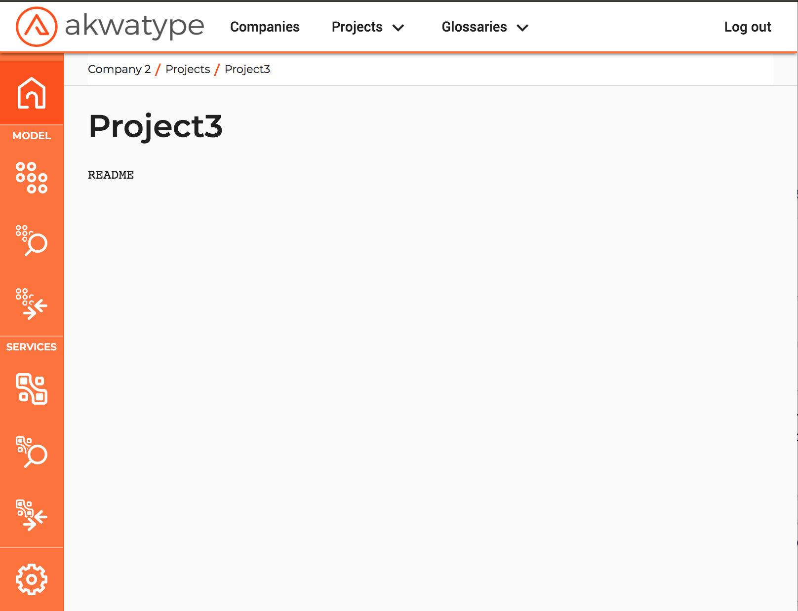
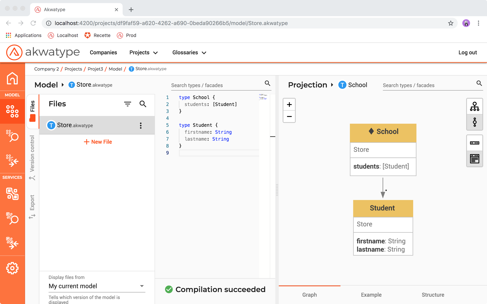

In your project, go to the model editor. 



Just click on the model editor button


And you get an empty editor. The editor is split in three columns :
- Files list
- A file's code
- A Projection of an object in the code


We will start by creating a new file, click on "+ New File" and get the popup as above.


Type a filename and click "+ Add", you will see your file in the list.
Click on the file in the list and you will see the code editor, empty for the moment.


Write an example model 

```graphql
type School {
  students: [Student]
}

type Student {
  firstname: String
  lastname: String
}
```


