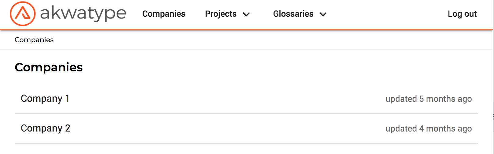
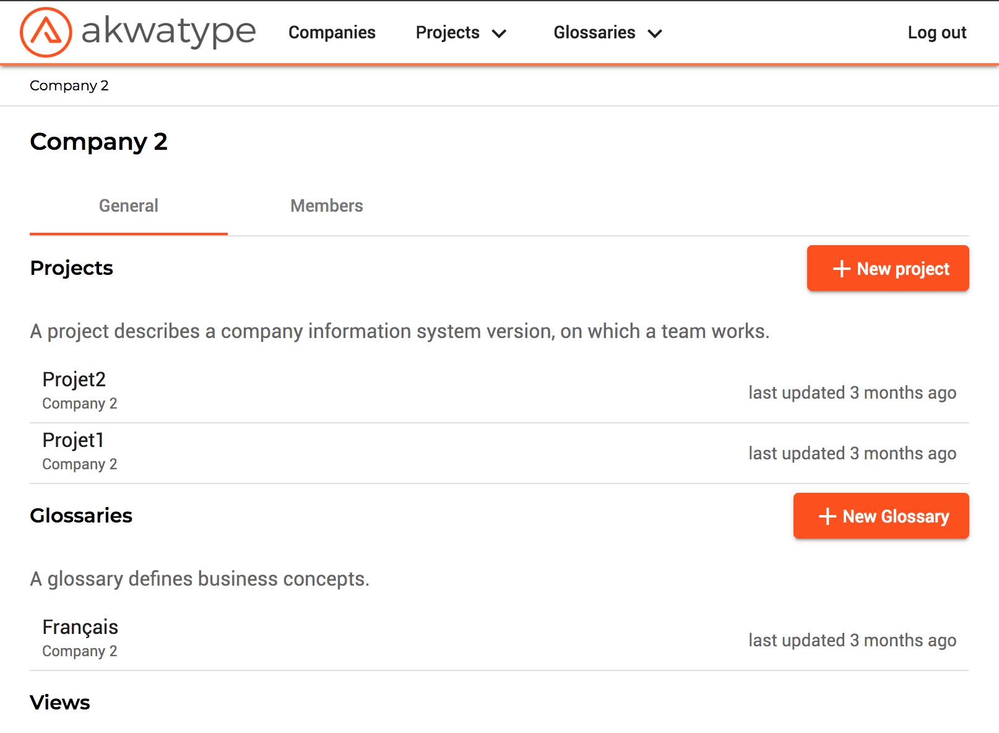
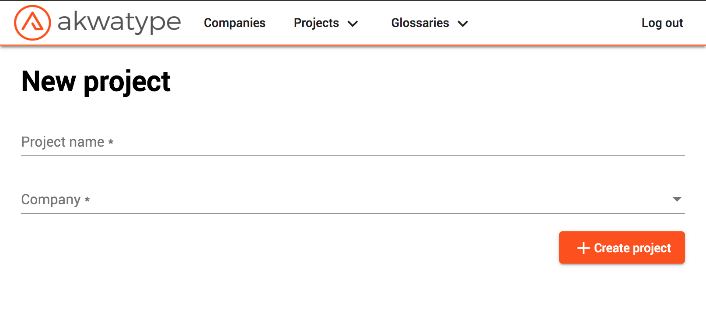
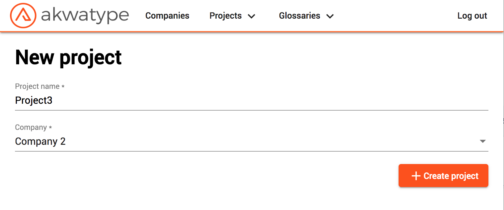
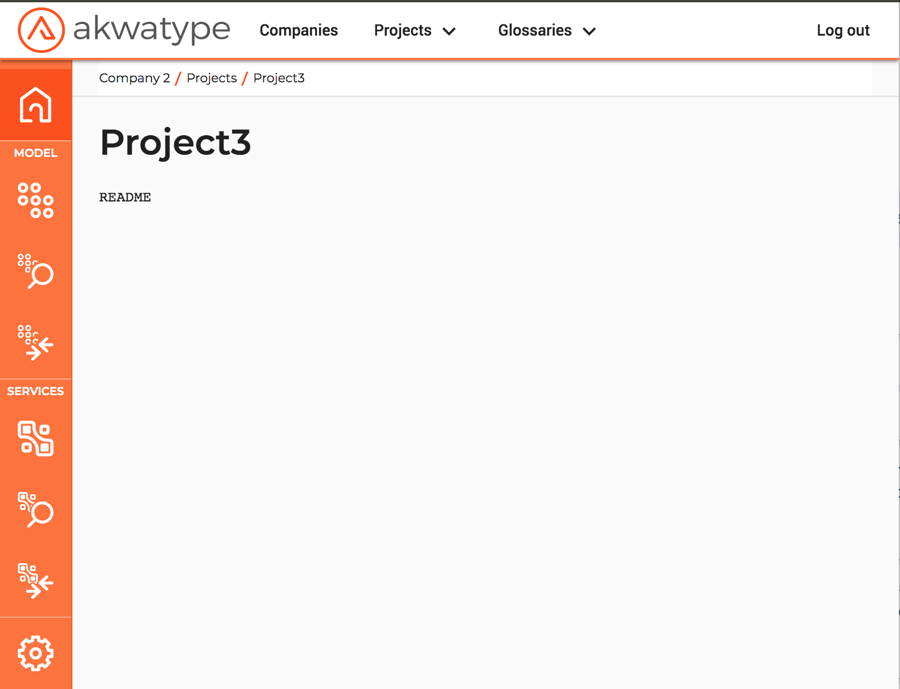

On this page, you'll learn about how to create a new project to make some change on the company model.

## You can create a project attached at your company

Open the companies page with the Companies button on the menu

Choose the company in the list by clicking on it

This page presents all informations on the company.
You can open a project in the list by clicking on it, but for the moment, we want create a new project.
You click on the button "+ New project"

You need to fill the form with a project name, and choose the company in the list.

Then you click on the "+ Create project" button.
You will be redirected to the new project home page. 

You will see a new menu on the left of your screen

First button, is the project home page.

Next block is for model actions, go to the model editor, do a model exploration or model comparison.

Next block is for services actions, go to the services editor, do a services exploration or services comparison.

Finally, last button go to the settings of the project.

